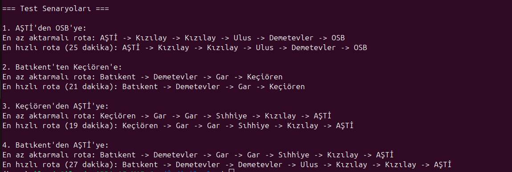

# Metro Rota Planlayıcı

Bu proje, şehir içi metro ulaşım ağını modelleyerek, belirli iki nokta arasında en hızlı ve en az aktarmalı rotayı bulmayı amaçlayan bir algoritma uygulamasıdır. Kullanıcılar, çeşitli metroların istasyonları arasında gezinebilir, farklı hatlar arası aktarmaları kullanarak en verimli rotayı bulabilirler.

## Kullanılan Teknolojiler ve Kütüphaneler

- **Python 3.x**: Proje, Python dilinde yazılmıştır.
- **heapq**: Öncelikli kuyruk (priority queue) yapısını implement etmek için kullanılan bir Python kütüphanesidir. A* algoritmasında en küçük maliyetli rotayı hızlıca bulmak için kullanılmıştır.
- **collections**: Bu kütüphane, Python'da veri yapıları ile çalışmayı kolaylaştırır. `deque` sınıfı BFS algoritmasında kuyruk oluşturmak için kullanılmıştır.
- **typing**: Python'da tip denetimi ve işlevsellik için `List`, `Dict`, `Tuple`, `Optional` gibi tip açıklamaları sağlamak için kullanılmıştır.

## Algoritmaların Çalışma Mantığı

### BFS Algoritması (Breadth-First Search)

BFS, genişlik öncelikli arama algoritmasıdır. Bu algoritma, bir başlangıç noktasından başlayarak tüm komşuları sırayla keşfeder. Şu adımlarla çalışır:
1. Başlangıç istasyonunu kuyruğa ekleriz.
2. Kuyruk boşalana kadar, her bir istasyonu ve ona komşu olan istasyonları ziyaret ederiz.
3. Ziyaret ettiğimiz istasyonları bir set içerisinde tutarak, aynı istasyonu tekrar ziyaret etmeyiz.
4. Hedef istasyonuna ulaşınca yol geri döndürülür.

**Neden BFS?**
- BFS, tüm olasılıkları keşfederek, en az aktarmalı rotayı bulmamızı sağlar. Her seviyedeki komşuları keşfederek, hedefe en kısa sürede ulaşmak için uygun rotayı bulur.

### A* Algoritması (A Star)

A* algoritması, hem en kısa yolu hem de tahmin edilen maliyeti minimize etmeyi amaçlayan bir algoritmadır. Çalışma mantığı şu şekildedir:
1. Başlangıç istasyonundan itibaren her bir istasyonun maliyetini hesaplarız.
2. Tahmini maliyet, mevcut maliyet ve hedefe olan uzaklık arasındaki farkı göz önünde bulundurur. Bu tahmini maliyet, "heuristic" (sezgisel) fonksiyon ile hesaplanır.
3. Öncelikli kuyruk (heap) kullanarak, her adımda en düşük toplam maliyeti olan istasyonu seçeriz.
4. Hedefe ulaşınca, en hızlı yolu ve maliyeti döndürürüz.

**Neden A*?**
- A* algoritması, hedefe ulaşmaya yönelik tahminleri kullanarak çok daha hızlı sonuçlar verebilir. BFS'ye göre daha optimize ve etkili bir arama yapar.

## Örnek Kullanım ve Test Sonuçları

Aşağıda verilen örnek kullanımda, AŞTİ'den OSB'ye ve Batıkent'ten Keçiören'e en hızlı ve en az aktarmalı rotalar hesaplanmaktadır.

### Örnek:
```python
metro = MetroAgi()

# İstasyonlar ekleniyor
metro.istasyon_ekle("K1", "Kızılay", "Kırmızı Hat")
metro.istasyon_ekle("K2", "Ulus", "Kırmızı Hat")
metro.istasyon_ekle("K3", "Demetevler", "Kırmızı Hat")
metro.istasyon_ekle("K4", "OSB", "Kırmızı Hat")

metro.baglanti_ekle("K1", "K2", 4)
metro.baglanti_ekle("K2", "K3", 6)
metro.baglanti_ekle("K3", "K4", 8)

# Test: AŞTİ'den OSB'ye rota
rota = metro.en_az_aktarma_bul("M1", "K4")
print("En az aktarmalı rota:", " -> ".join(i.ad for i in rota))


#Output

